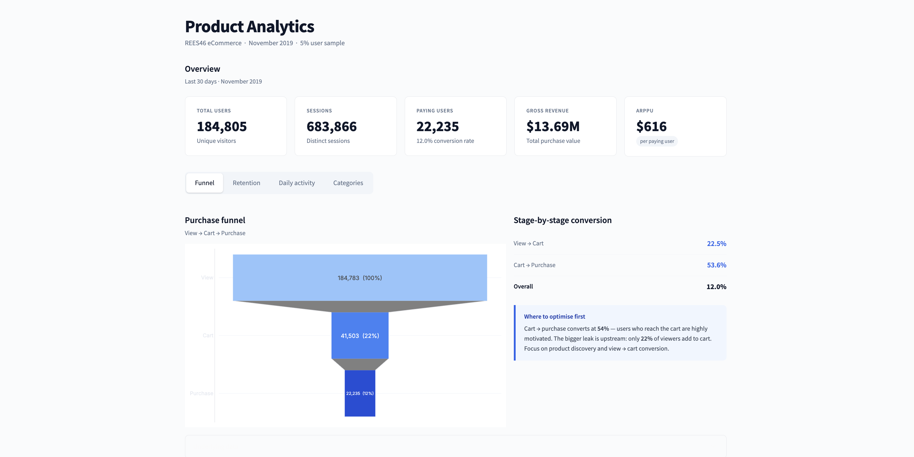
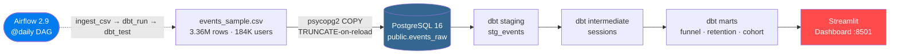
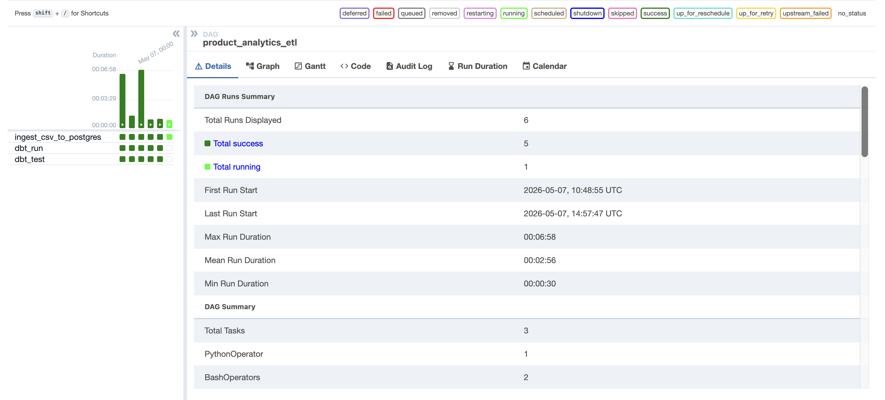
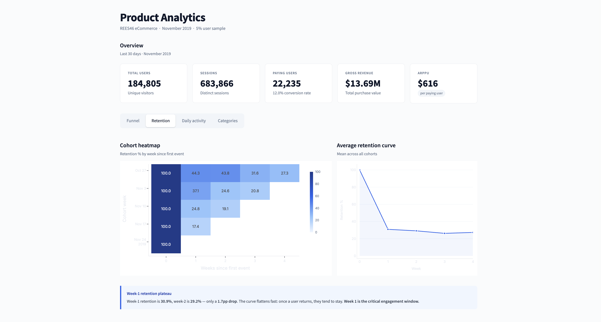
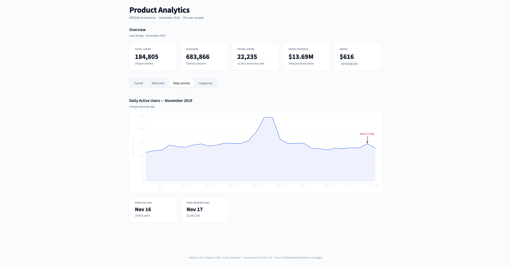
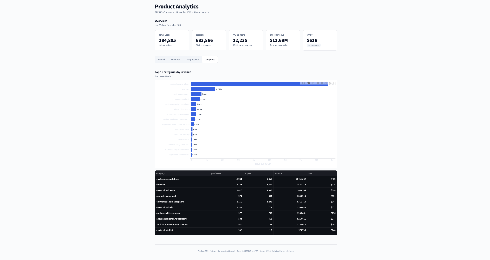

# Product Analytics ETL Pipeline

End-to-end batch pipeline analyzing 3.36M e-commerce events to surface funnel, retention, and cohort insights.

[](https://placeholder.url)
[](https://placeholder.url)


---

## Live Demo

🔗 [Live Dashboard](#) — deploy link coming after publish  
📦 [Source Code](#) — GitHub link coming after push



---

## Key Findings

Measured against a 5% stratified sample of the REES46 November 2019 clickstream
(3.36M events, 184,805 users):

- **Cart-to-purchase converts at 53.6%** — well above typical e-commerce rates —
  but only **22.5% of viewers** add anything to cart, making view → cart the
  primary optimization target.

- **Week-1 retention is 30.9%**, with only a 1.8 pp drop to week 2 (29.2%).
  The retention curve flattens almost immediately: once a user returns once,
  they tend to stay. Week 1 is the critical engagement window.

- **$13.7M GMV** across 22,235 paying users, with **$616 average revenue per
  paying user** (ARPPU). Total unique users: 184,805. Sessions: 683,866.

---

## Architecture



All services run in Docker Compose on a single machine. Airflow triggers the three-task
DAG in sequence; `max_active_runs=1` prevents duplicate loads.

---

## Tech Stack

| Layer | Tool | Why |
|---|---|---|
| Ingestion | Python 3.11 + psycopg2 `COPY` | 5× faster than `pandas.to_sql` for bulk loads |
| Raw storage | PostgreSQL 16 | Industry standard; TRUNCATE-on-reload for idempotency |
| Transformation | dbt 1.8 | Modular SQL, schema tests, `generate_schema_name` macro |
| Orchestration | Apache Airflow 2.9 | Production-grade `@daily` DAG, `max_active_runs=1` |
| Visualization | Streamlit 1.35 + Plotly | Analytics app with bind-mount hot-reload during dev |
| Container | Docker Compose | One-command reproducible environment |

---

## Sample Output

**Airflow DAG — all three tasks green:**



**Validation queries run against the Dockerized Postgres (port 5433):**

```
=== Funnel ===
  stage   | stage_order | users  |       pct_of_top       |      pct_of_prev
----------+-------------+--------+------------------------+------------------------
 view     |           1 | 184783 |                    1.0 |                    1.0
 cart     |           2 |  41503 | 0.22460399495624597501 | 0.22460399495624597501
 purchase |           3 |  22235 | 0.12033033341811746752 | 0.53574440401898657928
(3 rows)

=== KPIs ===
 users  | sessions | buyers |     gmv
--------+----------+--------+-------------
 184805 |   683866 |  22235 | 13687157.04
(1 row)

=== Retention ===
 week_number | avg_pct
-------------+---------
           0 |  100.00
           1 |   30.91
           2 |   29.16
           3 |   26.23
           4 |   27.30
(5 rows)
```

---

## How to Run Locally

Prerequisites: Docker Desktop, Git.

```bash
# 1. Clone
git clone https://github.com/[your-username]/product-analytics-etl.git
cd product-analytics-etl

# 2. Configure
cp .env.example .env          # edit passwords if needed

# 3. Build and start all services  (~3 min on first run)
docker compose up -d --build

# 4. Open the dashboard
open http://localhost:8501     # or browse manually
# Airflow UI: http://localhost:8080  (admin / admin)
```

The Airflow DAG runs automatically at its first scheduled interval. To trigger manually:

```bash
docker compose exec airflow-scheduler \
    airflow dags trigger product_analytics_etl
```

Place your own CSV at `dataset/events_sample.csv`, or point `RAW_CSV_PATH` in `.env` at
any compatible REES46-format clickstream file. The pipeline is unchanged either way.

---

## Project Structure

```
product-analytics-etl/
├── ingestion/          CSV → Postgres loader (psycopg2 COPY, idempotent)
├── dbt/                Staging views, intermediate tables, mart models + schema tests
├── dags/               Airflow DAG: ingest_csv → dbt_run → dbt_test
├── analytics/          Ad-hoc SQL: KPIs, funnel, retention (schema-qualified)
├── dashboard/          Streamlit app: 5 KPI cards, 4 tabs, Plotly charts
├── warehouse/          BigQuery DDL for production deployment
├── dataset/            Stratified sampling script; CSV files are gitignored
├── docker/             Airflow and dashboard Dockerfiles
├── screenshots/        Validation outputs and dashboard screenshots
└── docker-compose.yml  Full stack: postgres, airflow-db, airflow, dashboard
```

---

## Engineering Decisions

**Stratified user sampling over row sampling.**
Random row sampling breaks session integrity — a user's cart event might be sampled
but their purchase event not, producing an artificially low conversion rate. The sampler
selects 5% of users (seed 42) and retains *all* of their events, preserving complete
purchase journeys. Event-type distribution of the sample matches the full file within ±0.1%.

**TRUNCATE-on-reload as idempotency contract.**
Early builds appended rows on every DAG run; three Airflow triggers produced 10M rows
instead of 3.36M. The ingestion script now TRUNCATEs before loading. The contract is
explicit: this script loads this CSV into `events_raw`, replacing whatever was there.
Combined with `max_active_runs=1` in the DAG, concurrent duplicate loads are also prevented.

**30-minute sessionization threshold.**
A gap of > 30 minutes between events from the same user defines a new session. This is
the industry standard (used by Google Analytics and Adobe Analytics) and captures distinct
shopping intent windows without over-splitting sessions from users who pause briefly.

**`generate_schema_name` macro override.**
dbt's default behavior concatenates the profile schema with the model schema
(`public` + `staging` → `public_staging`). The macro override returns the custom schema
name directly, producing `staging`, `intermediate`, `marts` — matching what the analytics
SQL and Streamlit dashboard expect. Without this, every downstream query breaks.

**PostgreSQL for dev, BigQuery DDL for prod.**
Running against a local Postgres container keeps the iteration loop fast and free.
`warehouse/` contains production BigQuery DDL (partitioned by event date, clustered by
`user_id`). Switching targets is one dbt flag: `--target prod`.

---

## Screenshots

| | |
|---|---|
|  | `docker compose ps` — all 5 services up and healthy |
|  | Airflow DAG: `ingest_csv → dbt_run → dbt_test`, all green |

| | |
|---|---|
|  | Overview tab: 5 KPI cards, funnel chart, stage-by-stage conversion |
|  | Retention tab: cohort heatmap + average retention curve |

| | |
|---|---|
|  | Daily activity tab: DAU chart with Black Friday annotation (Nov 29) |
|  | Categories tab: top 15 categories by revenue, horizontal bar chart |

---

## Future Improvements

- **Incremental dbt models** — current models do a full refresh on every run; switching
  to `incremental` strategy would reduce transform time by ~95% at production scale.
- **CI/CD via GitHub Actions** — run `dbt test` and a smoke-test query on every PR
  before merge; block deploys on test failure.
- **BigQuery production deployment** — DDL is already written in `warehouse/`; needs
  GCP service account credentials wired into the Airflow environment.
- **Real-time streaming** — replace the daily CSV batch with a Kafka topic consuming
  live events; dbt Streaming or Materialize for low-latency mart updates.
- **ML layer** — RFM segmentation or churn-probability scoring using the existing
  `sessions` and `retention` mart tables as features.

---

## Author

[Your name] — [LinkedIn](#) — [GitHub](#)

---

*Dataset: [REES46 eCommerce Behavior Data](https://www.kaggle.com/datasets/mkechinov/ecommerce-behavior-data-from-multi-category-store)
via Kaggle. November 2019 clickstream from a multi-category Russian eCommerce store.*
